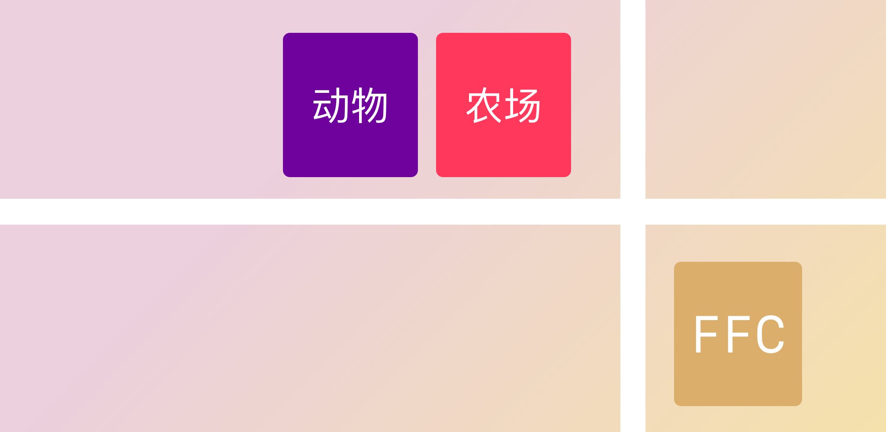

# Animal Farm

## What is it?

An open sourced Android project constains a story book named "Twenty First Century Farm".

The app can be downloaded from the [Google Play](https://play.google.com/store/apps/details?id=com.artlvr.animalfarm).

## Technical scopes

The project has been built up using the following tools:

- [`Jetpack Compose`](https://developer.android.com/jetpack/compose): A framework to build user interface in a declaritive fashion;
- [`Kotlin`](https://kotlinlang.org): A programming language for build Android projects.

## License

The project is licensed under [WTFPL](LICENSE).

